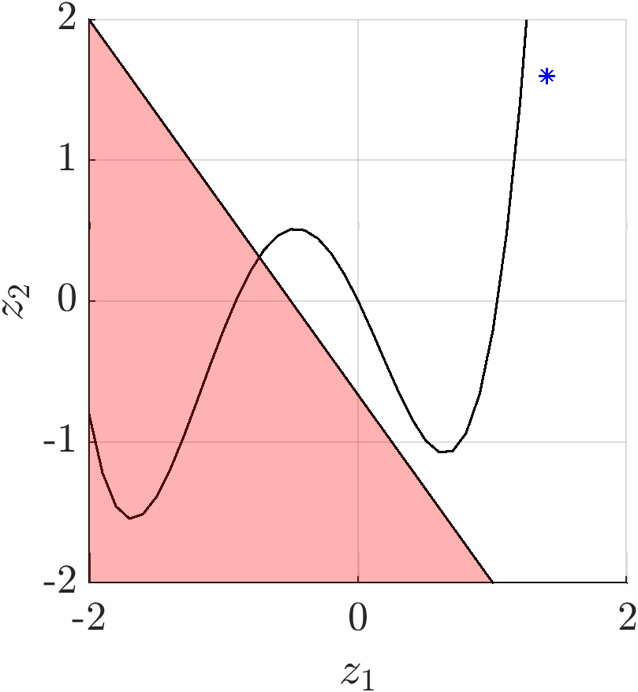

# The SCvx* Algorithm

This repo implements the SCvx* algorithm to solve nonconvex optimization problems, and in particular nonconvex trajectory optimization problems. The SCvx* algorithm is a variant of the Sequential Convex Programming (SCP) algorithm, proposed in [Oguri (2023)](https://ieeexplore.ieee.org/document/10383462).

    

## Necessary Software

1. MATLAB (tested with version R2023b).
2. YALMIP: https://yalmip.github.io/ (tested with version R20230622)
3. Mosek: https://www.mosek.com/ (tested with version 10.1). Academic users can get a free license for Mosek. Other second-order cone programming (SOCP) solvers can also be used.
4. (Optional) MATLAB Parallel Computing Toolbox: The discretization via numerial integration inside the SCP algorithm can be parallelized using the MATLAB Parallel Computing Toolbox.
5. (For example 3) NAIF SPICE Toolkit: https://naif.jpl.nasa.gov/naif/toolkit.html, along with the necessary SPICE kernels.

## Directory Structure

The repository contains the following main files:

- `src/@SCvxStar/SCvxStar.m`: The main class of the SCvx* algorithm
- `src/SCPProblem.m`: An abstract class that serves as a template for objective function and cost functions. The user should inherit from this class to define their own objective function and cost functions.
- `src/SCPParams.m`: A class with the options of the SCvx* algorithm. The user can optionally set the options of the SCvx* algorithm by creating an instance of this class, modifying the properties, and passing it to the SCvx* algorithm.
- `example1/example1.m`: The main script with implementation of example 1 in Oguri (2023)
- `example1/ExampleClass1.m`: A class that defines the objective funtion and cost functions of example 1 in Oguri (2023). This class serves as a template for the user to define their own objective function and constraint functions, inheriting from the class `SCPProblem.m`

See `example1.m` for an example of how to use the `SCvxStar` class and its methods. Other examples are also provided in the repository. The `+astro` module contains the necessary parts of a larger astrodynamics library that is used in the examples.

## How to define your own objective function and cost functions

To define your own objective function and cost functions, you should inherit from the class `SCPProblem`. The inherited class should have the following methods:

- `impose_trust_region_struct`: A struct with variable names as the fieldnames (e.g. $x$, $u$) and boolean values as the field values, indicating whether the trust region should be imposed on the variable. Usually, when solving trajectory optimization problems with control-affine dynamics, the trust region is imposed on the state but not on the control.
- `init_guess_struct`: A struct with variable names as the fieldnames (e.g. $x$, $u$) and initial guess values as the field values. 

The inherited class should also have the following properties:

- `vars = define_vars(obj)` : The method that defines the variables of the optimization problem. The method should return a struct with the variable names as the fieldnames (e.g. $x$, $u$) and the corresponding YALMIP variables as the field values.
- `J0 = objective(obj, vars)`: The method that defines the objective function of the optimization problem. The method should return the objective function as a YALMIP expression. By assumption, the objective function is convex in the decision variables.
- `constraints = convex_eq(obj, vars)`: The method that defines the affine equality constraints of the optimization problem. The method should return the equality constraints as a YALMIP expression.
- `constraints = convex_ineq(obj, vars)`: The method that defines the convex inequality constraints of the optimization problem. The method should return the inequality constraints as a YALMIP expression.
- `constraintLHS = noncvx_eq(obj, vars)`: The method that defines the nonconvex equality constraints of the optimization problem. The method should return the left-hand side of the equality constraints. This function will be called with double type variables as the input and will return double type variables as the output, so it can use any numerical methods such as integration.
- `constraintLHS = noncvx_eq_relaxed(obj, vars, ref_vars)`: The method that defines the relaxed (convexified) nonconvex equality constraints of the optimization problem. The method should return the left-hand side of the relaxed equality constraints. This function will be called with YALMIP variables as the input and will return YALMIP expressions as the output.
- `constraintLHS = noncvx_ineq(obj, vars)`: The method that defines the nonconvex inequality constraints of the optimization problem. Similar to `noncvx_eq`.
- `constraintLHS = noncvx_ineq_relaxed(obj, vars, ref_vars)`: The method that defines the relaxed (convexified) nonconvex inequality constraints of the optimization problem. Similar to `noncvx_eq_relaxed`.

The inherited class can also define optional methods:

- `pre_iteration(obj, ref_vars)`: A method that is called before each iteration of the SCP algorithm. Default is empty.
- `post_iteration(obj, vars, ref_vars, iter)` : A method that is called after each iteration of the SCP algorithm. Default is empty.
- `convexified_exact(obj, vars, ref_vars)`: Constraints that are imposed exactly (without slack variables)
after convexification but change every iteration. Default is empty.

The user can also define any other methods and properties that are necessary for the optimization problem.

## Instructions to run the examples

- For example, `addpath example1` from the root directory of the repository and run `example1.m`.

## References

[1] K. Oguri, “Successive Convexification with Feasibility Guarantee via Augmented Lagrangian for Non-Convex Optimal Control Problems,” Dec. 2023, Singapore. https://arxiv.org/abs/2304.14564

[2] N. Kumagai and K. Oguri, “Adaptive-Mesh Sequential Convex Programming for Space Trajectory Optimization,” Journal of Guidance, Control, and Dynamics, Vol. 47, No. 10 (2024), pp. 2213-2220 https://doi.org/10.2514/1.G008107
